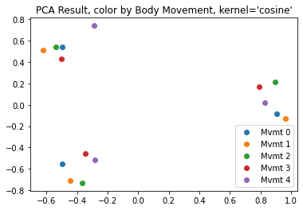

# Pison Interview Project: Classification of Wrist Gestures

----

## Data Characterization

Before considering what wrist-motion classes are present throughout the dataset, I first set out to understand the intrinsic characteristics of each channel of data. The first distinction I made within the numerous channels was that there were two basic categories of sensor: EMG sensors and dynamics sensors.  To become more familiar with both groups of sensors, I plotted each channel for each body movement and repetition (see `emg_analysis.ipynb` and `dynamics_analysis.ipynb`) and did a quick literature review on EMG signal analysis [1] and quaternion outputs from IMUs [2], which
were less intuitive than the accelerometer and gyroscope sensor datasets.

### Nerve Channel Data

From reading [1], EMG data is often distorted if electrodes shift on the surface of the skin, causing large swings in lower frequencies due to slow impedance changes. High passed data was mostly associated with the start of large dynamics events and varied between observations mostly in impulsivity or total bandwidth.  It was immediately clear from both the raw signal and the high passed channels that behavior was not greatly distorted in magnitude or by different movement classes. Nerve data was properly processed down to one channel for both raw and high passed data as these signals were differential pairs.

### Dynamics Data

The dynamics data was relatively straightforward to interpret for the standing cases, and the largest feature of these data were correlations between different axes of each sensor.  Determining differences between different repetitions was clear when considering which axes moved together, opposite, or in a completely unrelated fashion.  Amplitudes and zero or mean crossings also seem especially relevant as this would pick up on primary axes of motion and how rapidly these axes were reversed in orientation or rate of change.

## Description of Movements

There are three distinct movement patterns in this data that can be characterized by gyroscope and accelerometer data and visualized by plotting the quaternions in euler format.  Note that gravitational acceleration shows up as a constant -9.8 m/s/s when the device is oriented flat on a table.

1. "Doorknob" - This class was characterized by rotation about the Z axis with slight rotations in Y, which resembles turning a doorknob about a quarter turn.  A quarter turn aligns well with the accelerometer readings of `ax` and `az` meeting at the peak of the rotation, meaning gravitational acceleration is perfectly split between the two at 45 degrees of rotation.

2. "Keyboard" - This class was characterized by rotation about X.  This would look someone moving their hand out to hit a key on a keyboard at waist height when standing.  We again see two acceleration axes, Y and Z, meet at the midpoint of the gesture, meaning a 45 degree angle was reached.  

3. "Brushing" - This class was characterized by pure and rapid rotation about the Y axis with acceleration in the X and Y axes that are in phase.  For lack of a better description, this looks like someone brushing eraser dust off of a sheet of paper.  This class was also clearly distinct in the EMG data as a series of very impulsive muscle activation potentials.

Conveniently, each repetition was in class order for all body movements.

## Feature Extraction and Clustering

When testing different features' ability to discriminate between wrist-motion classes, trial and error is necessary.  To shorten trial and error iteration time, I created a small framework for specifying functions that would take whole channels or segmented channel data and produce well labeled scalar features.

1. `FeatureExtractor` class - This is a class that applies a function that holds column(s) names, a function that extracts a scalar feature from a `ndarray`, and optionally can segment a channel to apply the function over different samples in the dataset.  This class makes it easy to define many different feature extractors for all channels of data.

2. `process_dataframe` function - This routine takes a full `DataFrame` of raw sensor data and lists of `FeatureExtractor`s for each channel and produces a normalized result ready for clustering.

### Primary Features

To extract features from EMG data, the most valuable information was embedded in the total power of both the raw EMG data and the bandwidth of the high passed information.  Perhaps the most distinct feature set was spectral entropy, which was instrumental on picking up on the impulsiveness of the third gesture.

Dynamics data was best summarized by correlations between channels of data to summarize the relationships between movements and accelerations.  This was especially clear in the IMU and accelerometer data.  For gyroscope data, amplitude and total signal power was relevant for picking out the primary axes of rotation.

When these feature vectors underwent dimensionality reduction with kernelized PCA, it was clear that the features generalized well across different body movements and produced distinct, tight clusters in two dimensions that were clean inputs to a simple classifier like LDA or a SVM.  Note in the plots below that generalization was excellent across body movement as each cluster features a sample from each movement category.

## Classification

The features selected led to a clean result, suitable for most classifiers. As determined by clustering, class labels were simply the repetition number.  While linear discriminant analysis and a linear support vector machine were tested, the distinctness of clustering would lead to perfect classification with most choices.  The classifiers tested all scored 100% accuracy with perfect specificity and sensitivity for all iterations of 3 fold cross validation (see `full_sensor_analysis.ipynb` for details).

## Works Cited

[1] Raez, M. B., Hussain, M. S., & Mohd-Yasin, F. (2006). Techniques of EMG signal analysis: detection, processing, classification and applications. Biological procedures online, 8, 11–35. https://doi.org/10.1251/bpo115

[2] “Visualizing Quaternions (4d Numbers) with Stereographic Projection.” Youtube, 6 Sept. 2018, https://www.youtube.com/watch?v=d4EgbgTm0Bg. Accessed 11 Oct. 2021. 
